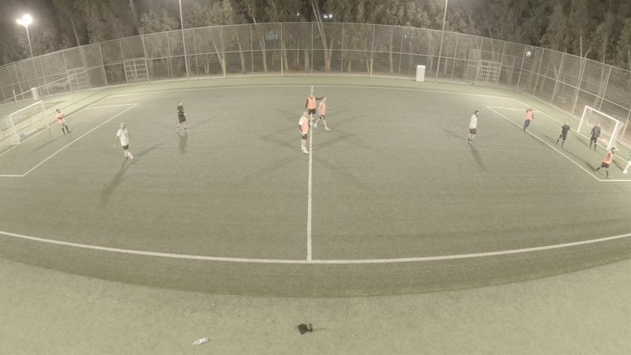

# --FUTSAL PLAYER TRACKING--

Build a post-processed computer-vision system that takes a recording of an amateur futsal match (most likely a single static wide-angle camera) and automatically reconstructs the game: reliably detecting and tracking all players and the ball throughout the match, maintaining persistent identities despite occlusions, grouping players into teams even if kits are inconsistent (e.g. non-bibbed team have different coloured jerseys), identifying players via visible jersey numbers where possible, inferring key game events such as possession, passes, shots, and goals, and mapping all movement into a consistent bird’s-eye tactical view—prioritising accuracy, robustness, and analytical insight over real-time performance, preferably requiring no specialised hardware or wearables.  They idea is a low barrier of entry for users .... simply turn up and play.

NOTES:
Accuracy > features. If player IDs, ball tracking, and possession are wrong, users will abandon it quickly.
Low friction onboarding. If setup, calibration, or manual correction is heavy, adoption dies.
Clear v1 promise. Users don’t need tactics analytics — they want:
- “Did it track me correctly?”
- “Did I get stats that feel fair?”
Venue-first distribution beats individual sales (install once, many users).
- Inconsistent player identity, Ball tracking errors, and inaccurate events would kill the project

Bluntly: This is a trust product. Accuracy buys adoption. Everything else is secondary.

# CORE GOAL
Post-processing with video overlay to obtain:
- Individual player tracking.
- Ball tracking.
- Player positions on 2d map.
- Teams auto detected.
- Passes detected - completion rate and accuracy.
- Shots detected.
- Goals detected.
- Heatmaps for player movement.
- Player distance run.
- Player speed analysis.
- Match summary report generation.
- Player stats.
- Tackles/interceptions/blocks.

## Additional (2nd phase):
- Possession percentage per team/player
- Formation detection and transitions
- Pressing intensity metrics
- Pass network visualization
- Turnover locations
- Sprint detection and count
- Work rate zones (high/medium/low intensity)
- Corner kicks, free kicks, penalties
- Fouls and cards
- Goal Replays

# Full Product once above tasks produce accurate results
These accurate tracking stats and information will be used in a social application, think Strava for futsal.  Users can get automatic:
- game statistics
- player profiles (automatic based on playing performances)
- personal performance statistics
- team performance statistics
- replays of key moments
- player ratings per game
- positional information
- replay of game with AI commentary that can refer to past performances of players

To encourage engagment:
- Player of month (based on stats) at venues/countries etc
- Goal of the month votes at venues/countries etc
- comments/banter
- social posting of game footage

# TEST FOOTAGE
Currently we have test footage using a static GoPro wide angle camera. Constraints:
- Large file size (11gb for 15 minutes)
- FishEye effect
- Near corners of pitch missing

